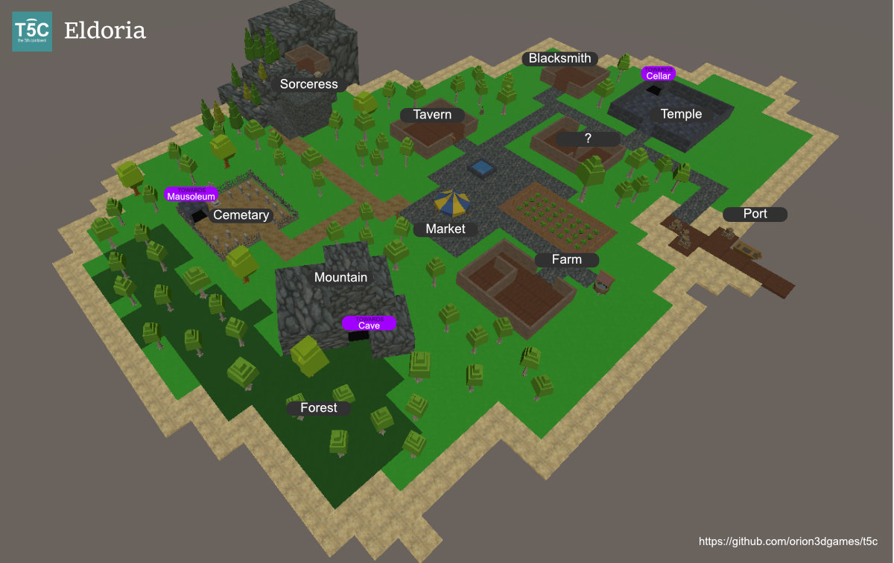

The 5th Coming
------------------

### Chapter 1: Beginnings in Eldoria

Eldoria was a quaint village nestled between lush forests and towering mountains. The village had a serene aura, but beneath its peaceful exterior, there were challenges that only a brave hero could tackle. In Eldoria, every corner held a potential quest, every alley a story waiting to unfold. As our hero embarked on these quests, they began to grow in strength and skill. The path to level 10 was arduous and filled with challenges, but with each defeated enemy and completed quest, the hero became a beacon of hope for Eldoria. The teachings of Athlea provided guidance and strength, illuminating the hero's path through the darkness. As the hero rose through the ranks, they became a symbol of Athlea's light, ready to face even greater threats in the future.

---  

---

### Locations

*   **Forge**: The heart of Eldoria’s craftsmanship, where the Blacksmith, Garin, forged weapons and armor to aid adventurers.
*   **Temple**: A sanctuary dedicated to Athlea, watched over by Priestess Alice, who also guarded the entrance to the rat-infested Cellar dungeon.
*   **Farm**: A sprawling field tended by Farmer Jorin, who provided food for the village.
*   **Tavern**: The lively hub of Eldoria, run by Bartender Morin, where stories and quests were exchanged.
*   **Market**: Bustling with activity, the Merchant Elara sold potions and jewelry to aid adventurers in their quests.
*   **Mountains**: Majestic and foreboding, they housed the entrance to the treacherous Cave dungeon.
*   **Cemetery**: A somber place tended by Caretaker Ren, and the entrance to the Mausoleum dungeon.
*   **Forest**: Dense and dark, home to fearsome Bandits and the site of many trials.
*   **Sorceress Tower**: The mystical home of Sorceress Mira, where adventurers could learn offensive magic.
*   **Velvet Veil**: A luxurious establishment in Eldoria, known for its warm hospitality, soothing ambiance, and vibrant performances. 
*   **Port**: Locations of future development and potential quests.

### Dungeons

*   **Cellar**: Beneath the Temple, infested with sneaky Rats, perfect for novice adventurers.
*   **Mausoleum**: In the Cemetery, filled with powerful Skeletons, posing a greater challenge.
*   **Cave**: In the Mountains, housing cunning Mummies, a trial for the most seasoned heroes.

### People

*   **Blacksmith Garin**: A master of the forge, providing essential equipment.
*   **Merchant Elara**: A savvy trader in potions and enchanted items.
*   **Sorceress Mira**: A wise mage who trained adventurers in offensive magic and resided in the Sorceress Tower.
*   **Priestess Alice**: A devout priestess who taught defensive spells and sought help for the Temple’s troubles.
*   **Farmer Jorin**: A simple farmer with untold stories.
*   **Bartender Morin**: The keeper of the tavern and a source of many quests.
*   **Caretaker Ren**: Guardian of the cemetery, harboring secrets of the Mausoleum.
*   **Madame Seraphina**: Proprietor of the Velvet Veil.

### Enemies

*   **Rats**: Infesting the Cellar, a challenge for heroes levels 1-3.
*   **Skeletons**: Haunting the Mausoleum, suited for heroes levels 3-6.
*   **Bandits**: Roaming the Forest, a danger for heroes levels 6-8.
*   **Mummies**: Dwelling in the Cave, a peril for heroes levels 8-10.

### Character Stats

*   **Strength**: Affects melee damage.
*   **Endurance**: Increases health capacity and regen
*   **Intelligence**: Enhances spell power and increase mana regen.
*   **Wisdom**: Boosts defensive magic and increase mana capacity.

---  

## Default Dialogues

### Blacksmith Garin
- "Greetings, adventurer! Looking for a new weapon or some sturdy armor? I've got the finest in Eldoria."
- "If you need repairs, I'm your man. Can't have you going into battle with a broken blade!"

### Merchant Elara
- "Welcome to my shop! Potions, jewelry, and more! What can I interest you in today?"
- "Remember, a well-prepared adventurer is a successful adventurer. Stock up before you head out!"

### Sorceress Mira
- "Ah, another seeker of knowledge. What arcane mysteries can I help you unlock today?"
- "The power of the elements is at your fingertips. Learn well, and use your magic wisely."

### Priestess Alice
- "Blessings of Athlea upon you. How can I assist you in your journey?"
- "Our temple is a place of healing and peace. May Athlea's light guide and protect you."

### Farmer Jorin
- "Good day! The crops are growing well this season. Can I interest you in some fresh produce?"
- "It's hard work, but honest work. The land provides for those who tend to it with care."

### Bartender Morin
- "Welcome to the tavern! Sit, have a drink, and share your tales of adventure."
- "We've got the best ale in Eldoria. A drink here is the perfect end to a long day of questing."

### Caretaker Ren
- "The cemetery holds many secrets. Respect the dead, and they may offer you their wisdom."
- "It's a somber task, but someone must care for those who have passed. What brings you here today?"

---

### Quests 

#### Clearing the Cellar

_Quest Giver:_ Priestess Alice
_Objective:_ Kill 10 Rats in the Cellar.
_Dialogue:_
*   _Priestess Alice:_ "Adventurer, our temple is plagued by a rat infestation in the basement. Will you help us cleanse this holy place?"
*   _Adventurer:_ "I will handle the rats for you, Priestess."

#### Collecting Bones

_Quest Giver:_ Sorceress Mira
_Objective:_ Collect 20 Bones from Skeletons in the Mausoleum.
_Dialogue:_
*   _Sorceress Mira:_ "I require bones from the Mausoleum’s skeletons for my research. Can you gather them for me?"
*   _Adventurer:_ "Consider it done, Sorceress."

#### Clearing the Forest

_Quest Giver:_ Bartender Morin
_Objective:_ Kill 20 Bandits in the Forest.
_Dialogue:_
*   _Bartender Morin:_ "The Bandits in the forest are becoming a menace. Can you help us by dealing with them?"
*   _Adventurer:_ "I’ll take care of the Bandits for you."

#### Collecting Cotton Straps

_Quest Giver:_ Merchant Elara
_Objective:_ Collect 20 Cotton Straps from Mummies in the Cave.
_Dialogue:_
*   _Merchant Elara:_ "I need cotton straps from the mummies in the cave for my trade. Will you gather them for me?"
*   _Adventurer:_ "I’ll retrieve the straps for you, Merchant."

---  

### Items

#### Drops

*   **Health Potions**: Dropped by all enemies.
*   **Mana Potions**: Dropped by all enemies.
*   **Amulet +1**: Rare drop from Skeletons.
*   **Bones**: Dropped by Skeletons, quest item.
*   **Helm +1**: Rare drop from Bandits.
*   **Staff +1**: Rare drop from Mummies.
*   **Cotton Straps**: Dropped by Mummies, quest item.

#### Merchant Items

*   **Health Potion Small**: Restores a small amount of health.
*   **Health Potion Medium**: Restores a moderate amount of health.
*   **Mana Potion Small**: Restores a small amount of mana.
*   **Mana Potion Medium**: Restores a moderate amount of mana.

#### Blacksmith Items

*   **Weapon +1**: Suitable for level 1-3 adventurers.
*   **Weapon +2**: Suitable for level 4-6 adventurers.
*   **Weapon +3**: Suitable for level 7-10 adventurers.
*   **Helm +1**: Suitable for level 4-6 adventurers.

---   

### Abilities & Spells

#### Abilities

*   **Basic Weapon Attack**

#### Spells

*   **Fireball**: Taught by Sorceress Mira.
*   **Heal**: Taught by Priestess Alice.